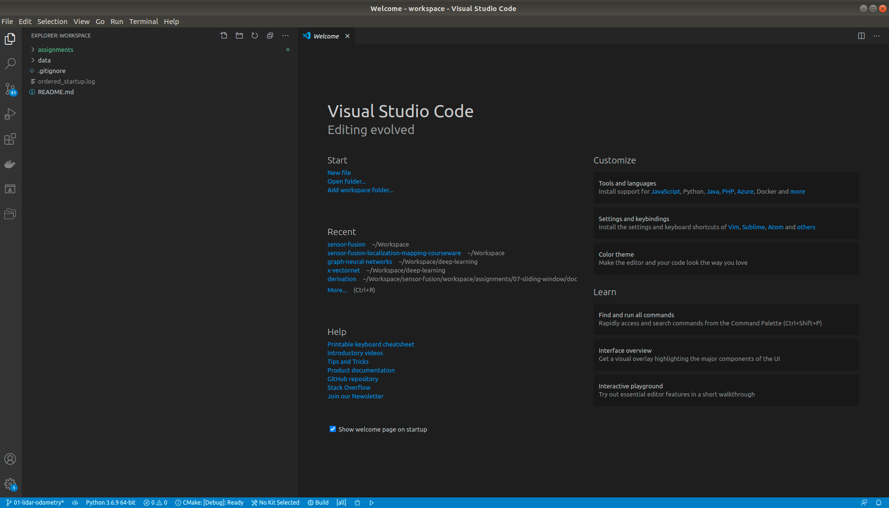

# Multi-Sensor Fusion for Perception -- 多传感器融合感知

Maintained by **Ge Yao**, alexgecontrol@qq.com

---

## Up & Running

---

### Overview

本Repo为基于**ROS melodic** @ **Ubuntu 18.04**的**Multi-Sensor Fion for Perception/多传感器融合感知**学习环境. 

本学习环境以**Docker Image**的形式提供, 在与Native PC环境隔离的基础上, 以开箱即用的形式提供所需的全部依赖. 

**Note** 本项目Native PC的操作系统选择**Ubuntu**. **在Windows与Mac平台上未曾测试**. 若有意尝试, 请自行搜索相关解决方案.

---

### 安装Ubuntu

首先请确保您可以访问**Ubuntu**开发环境. 如果没有**Ubuntu**环境, 请按照[点击链接进入](ubuntu-setup/README.md)指南, 在本地PC上安装配置**Ubuntu**环境.

---

### 获取Docker环境

[请按照教程完成Docker环境的配置](docker/README.md). Docker提供了一个轻量级的标准化开发环境, 能够避免环境配置差异导致的诸多问题.

---

### Using Workspace

当Native PC与Course Docker Environment均准备就绪时, 即可开始使用本开发环境:

* **第一次使用时, 请首先下载配套的nuScence数据集**[here](workspace/data/nuscenes/README.md).

* 之后, 即可通过**本地VSCode开发, Docker内部编译测试**的模式, 完成课程作业.

#### 获取课程数据

在第一次使用时, 需要将**配套的nuScence数据集**下载至本地文件系统. 具体操作方法参考[点击链接进入](workspace/data/nuscenes/README.md)

#### 开发, 编译与测试

启动Docker环境后, **Docker**中的/workspace目录, 会被映射到**当前Repo**中的workspace目录.

使用该Workspace进行开发, 编译与测试的方法如下:

* 在**当前Repo的workspace**下, 启动[VSCode](https://code.visualstudio.com/), 编辑源代码:

* 在**Docker /workspace**下, 进行编译.

---

## Q & A

---

### How to Contact Me

Please submit your bug report & feature request to this repo.

---

Keep Learning & Keep Coding

Ge Yao, alexgecontrol@qq.com