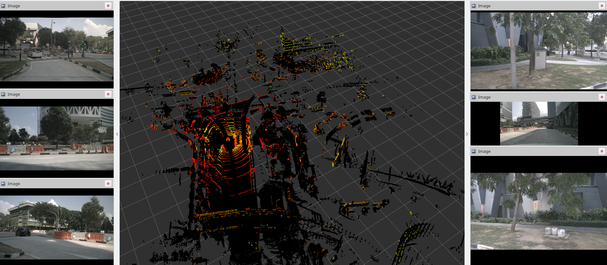

# nuScenes2Bag

Simple C++ tool from [Kudos to Lucas!](https://github.com/lukasstaecker/nuscenes2bag) for converting the [nuScenes](https://www.nuscenes.org/) dataset from [Aptiv](https://www.aptiv.com).

The tool loads the json metadata and then the sample files for each scene. The sample are converted in a suitable ROS msg and written to a bag. TF tree is also written.

Probably the original dataset is also collected by Aptiv using ROS, so most data has the same format.



---

## Install

The tool is a normal ROS package. Place it under a workspace and build it with catkin.

## Usage

### Command-line Arguments

* `--dataroot,-s`: The path to the directory that contains the 'maps', 'samples' and 'sweeps'.
* `--version`: (optional) The sub-directory that contains the metadata .json files. Default = "v1.0-mini"
* `--scene_number,-n`: (optional) Only convert a given scene
* `--compress,-c`: (optional) whether to use compressed images to reduce file size

## Converting the 'mini' Dataset

Convert one scene to a bag file, saved in a new directory:
Scene '0061' will be saved to 'nuscenes_bags/61.bag'

```bash
rosrun nuscenes2bag nuscenes2bag \ 
    --dataroot /workspace/data/nuscenes/raw \ 
    --out /workspace/data/nuscenes/rosbags \ 
    --compress \ 
    --jobs 8  
```

## Status

Currently work in progress

- [x] Image support
- [x] Pointcloud support
- [x] Radar support
- [x] EgoPose and TF support
- [x] Show progress
- [ ] Better usability

Create an Github issue for suggestion, bug and requests.

## Thirdparty

Built using:

 - https://github.com/nlohmann/json
 - http://github.com/en4bz/ThreadPool
